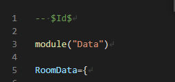

# Lua tools

Lua 工具集

## 編譯

編譯細節可以參考 [Makefile](./Makefile)。

- 編譯

    ```bash
    make build
    ```

- 跨平台編譯

    |平台|amd64|arm64|
    |-|-|-|
    |windows|✔️|❌|
    |darwin|✔️|✔️|
    |linux|✔️|✔️|

    ```bash
    make all
    ```

## 工具說明

- Lua table 深層比對工具

    將 table 載入 lua 虛擬機後進行深層比對。

    - 字串差異檢測

    - 數值差異檢測

    - table 鍵值檢測

    |長參數|短參數|選填|說明|預設值|範例|
    |-|-|-|-|-|-|
    |--file|-f|❌|Lua A/B 比對檔案路徑|""|RoomData.lua|

    ```bash
    ./lua-file-compare -f a/RoomData.lua -f b/RoomData.lua
    ```

    - [通用工具指令](#通用工具指令)

    - [檔案規範](#檔案規範)

- Lua 檔案 數據展開工具

    將 table 載入 lua 虛擬機，重新排序所有鍵值，最後展開輸出至 `output` 目錄。

    輔助開發人員以比對軟體檢視檔案差異。

    |長參數|短參數|選填|說明|預設值|範例|
    |-|-|-|-|-|-|
    |--file|-f|❌|Lua 檔案路徑|""|RoomData.lua|

    ```bash
     ./lua-file-pretty -f RoomData.lua
    ```

    - [通用工具指令](#通用工具指令)

    - [檔案規範](#檔案規範)

---

## 通用工具指令

|長參數|短參數|選填|說明|範例|
|-|-|-|-|-|
|--help|-h|✔️| 幫助說明|-|
|--version|-v|✔️| 檢視程序建置版號|-|


## 檔案規範



- 允許任何開頭符合以上規範的檔案。

- 檔案名稱(不包含副檔名)必須與上圖中第五行一致。
